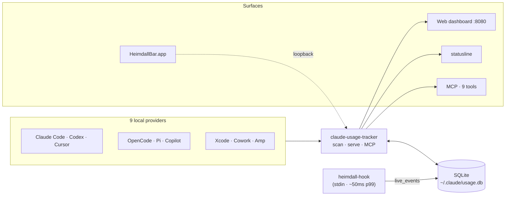
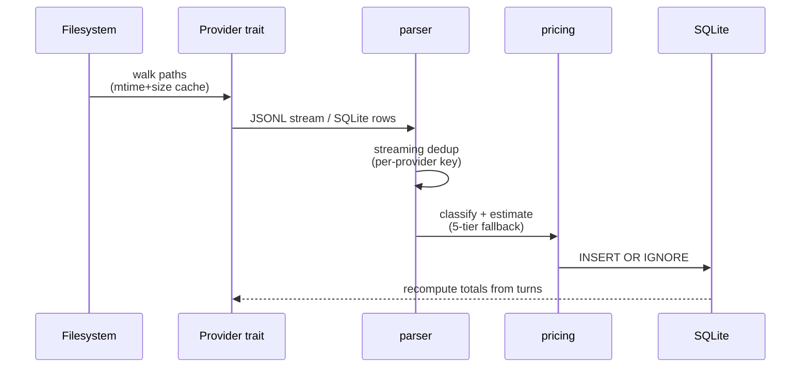
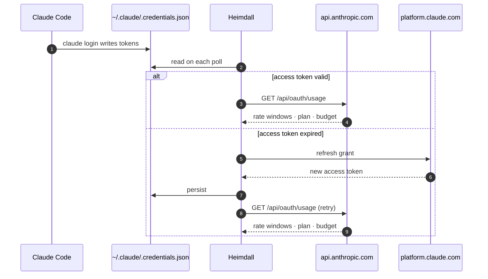

<p align="center">
  
</p>

<h1 align="center">Heimdall — Coding Agent Usage Tracker</h1>

<p align="center">
  Local analytics for Claude Code, Codex, Cursor, OpenCode, Pi, Copilot, Xcode CodingAssistant, Cowork, and Amp. Built in Rust.
</p>

Heimdall reads transcripts from every supported tool, then presents an interactive dashboard with cost estimates, billing-block burn-rate projection, cache efficiency, task categorization, activity heatmap, provider-aware filtering, waste-detection grade, context-window tracking, and rate-limit tracking — all running entirely on your machine.

Three surfaces ship together: `claude-usage-tracker` (CLI + dashboard), `heimdall-hook` (sub-second real-time ingest), and an MCP server exposing 9 analytics tools at inference time.

## Highlights

- **Multi-provider** — unified SQLite + dashboard for 9 coding assistants
- **Real-time hook** — `heimdall-hook` writes per-tool cost on every PreToolUse (~50 ms p99)
- **Statusline** — single-line cost / burn-rate / context indicator for Claude Code's status bar
- **MCP server** — 9 inference-time analytics tools over stdio + HTTP
- **5-hour billing blocks** — burn rate, projection, quota severity, gap visualization
- **Cost reconciliation** — hook-reported vs locally-calculated, divergence alerts at 10 %
- **Waste detector** — A–F grade with five detectors (CLAUDE.md bloat, ghost agents, MCP rereads, …)
- **Native macOS app** — `HeimdallBar.app` menu-bar widget + bundled CLI + browser-session import
- **Zero runtime dependencies** — single binary, cross-platform (macOS / Linux / Windows)

Full feature list: [docs/features.md](docs/features.md).

## Architecture



Pipeline + source layout: [docs/architecture.md](docs/architecture.md).

## Data flow



## OAuth flow



Full handshake + Codex/OpenAI paths + network surface: [docs/auth.md](docs/auth.md).

## Quick start

```bash
# Install on macOS (universal binary)
VERSION=$(curl -fsSL https://api.github.com/repos/po4yka/heimdall/releases/latest | jq -r '.tag_name')
curl -fsSL "https://github.com/po4yka/heimdall/releases/download/${VERSION}/heimdall-${VERSION}-universal-apple-darwin.tar.gz" \
  | tar xz --strip-components=1 -C /usr/local/bin

# Wire up live ingest + open the dashboard
claude-usage-tracker hook install
claude-usage-tracker dashboard --watch
```

Other platforms, Homebrew, from-source, daemon, scheduler, statusline, MCP install: [docs/install.md](docs/install.md).

A few representative commands:

```bash
claude-usage-tracker today --breakdown          # per-model sub-rows under provider totals
claude-usage-tracker blocks --token-limit=1M    # 5h billing block with quota
claude-usage-tracker optimize                   # waste-detector A–F grade
claude-usage-tracker mcp serve                  # MCP server (stdio)
claude-usage-tracker export --format=csv --period=month --output=usage.csv
```

Full CLI reference: [docs/cli.md](docs/cli.md).

## Documentation

| Topic | Doc |
|---|---|
| Feature catalogue | [docs/features.md](docs/features.md) |
| Install (all platforms · hook · statusline · MCP · daemon · scheduler) | [docs/install.md](docs/install.md) |
| HeimdallBar (native macOS app) | [docs/heimdallbar.md](docs/heimdallbar.md) |
| CLI reference | [docs/cli.md](docs/cli.md) |
| Configuration (TOML / JSON · per-command overrides · pricing) | [docs/configuration.md](docs/configuration.md) |
| REST API + SSE | [docs/api.md](docs/api.md) |
| Architecture & data flow | [docs/architecture.md](docs/architecture.md) |
| OAuth & credentials | [docs/auth.md](docs/auth.md) |
| Data sources | [docs/data-sources.md](docs/data-sources.md) |
| CloudKit sync | [docs/CLOUDKIT.md](docs/CLOUDKIT.md) |
| Desloppify workflow | [docs/desloppify.md](docs/desloppify.md) |
| Release process | [.github/RELEASING.md](.github/RELEASING.md) |
| Codebase guide | [CLAUDE.md](CLAUDE.md) |
| Development conventions | [AGENTS.md](AGENTS.md) |

## Development

```bash
cargo build                         # both binaries (default features incl. mcp + jq)
cargo build --no-default-features   # omit mcp subcommand for smaller binary
cargo test                          # full suite (880+ tests across 4 suites)
cargo clippy -- -D warnings
cargo fmt --check
./node_modules/.bin/tsc --noEmit    # TypeScript type check
npm run build:ui                    # recompile dashboard bundle
```

The release pipeline (`.github/workflows/release.yml`) builds all 5 targets on `v*.*.*` tag push and produces a consolidated `SHA256SUMS.txt`. The universal macOS artifact is produced by a post-matrix `lipo` job.

## Prior art & acknowledgements

Heimdall harvests patterns from sibling local-AI-observability projects:

- **[Codeburn](https://github.com/AgentSeal/codeburn)** — session parser, 13-category classifier, provider plugin pattern, `optimize` waste detector concept, SwiftBar widget, currency conversion.
- **[Third-Eye](https://github.com/fien-atone/third-eye)** — tool-event cost attribution, 7×24 heatmap, client-sent timezone handling, active-period averaging, cross-platform scheduler, CC-version tracking.
- **[Claude-Guardian](https://github.com/anshaneja5/Claude-Guardian)** — real-time PreToolUse cost injection, file-watcher auto-refresh, usage-limits parsing, cache-token breakdown, Homebrew + LaunchAgent + universal-binary stack.
- **[ccusage](https://github.com/ryoppippi/ccusage)** — 5-hour billing-block burn-rate + projection engine, statusline, MCP server, `$schema` config, project aliasing, Amp credit tracking, `--jq`, `--breakdown`, gap blocks, locale-aware dates, compact CLI.

Also inspired by [phuryn/claude-usage](https://github.com/phuryn/claude-usage) (Pro/Max progress bar) and [CodexBar](https://github.com/steipete/CodexBar) (menu-bar usage stats).

## License

BSD 3-Clause — see [LICENSE](LICENSE).

## Community

- [Contributing guide](CONTRIBUTING.md)
- [Code of Conduct](CODE_OF_CONDUCT.md)
- [Security policy](SECURITY.md)
